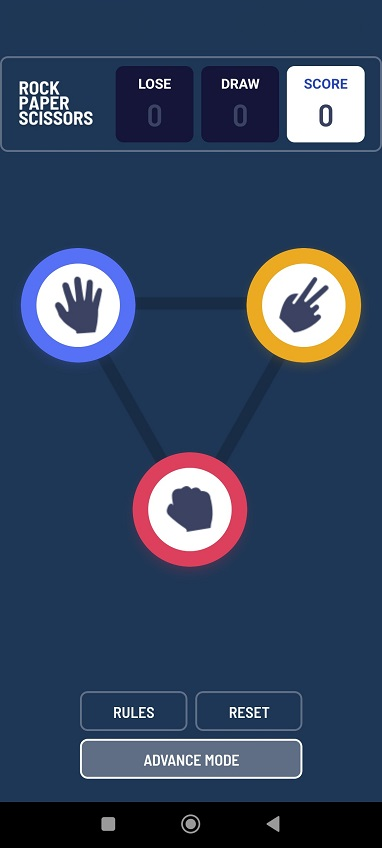

<a name="readme-top"></a>

<div align="center">
  <h1><b>Rock, Paper, Scissors Game</b></h1>

</div>

<!-- TABLE OF CONTENTS -->

## 📗 Table of Contents

- [📖 About the Project](#about-project)
  - [Screenshot](#screenshot)
  - [🛠 Built With](#built-with)
    - [Tech Stack](#tech-stack)
    - [Key Features](#key-features)
- [💻 Getting Started](#getting-started)
  - [Setup](#setup)
  - [Prerequisites](#prerequisites)
  - [Install](#install)
  - [Usage](#usage)
- [👥 Authors](#authors)
- [🔭 Future Features](#future-features)
- [🤝 Contributing](#contributing)
- [⭐️ Show your support](#support)
- [🙏 Acknowledgements](#acknowledgements)
- [📝 License](#license)

<!-- PROJECT DESCRIPTION -->

## 📖 Project Overview <a name="about-project"></a>

The Rock, Paper, Scissors, Spock game project has been crafted for React Native, offering an engaging and interactive experience tailored to mobile users. Developed using React Native, the project boasts a contemporary and user-friendly interface optimized for a wide range of devices. 

Players can enjoy the classic rock, paper, scissors game with an exciting twist featuring Spock and Lizard. Through lively animations, users challenge the computer, access game rules, and conveniently track their scores. This mobile game project not only entertains users of all ages but also introduces captivating animations that elevate the gaming experience.

### Screenshot




### 🛠 Built With <a name="built-with"></a>

#### Tech Stack <a name="tech-stack"></a>

- Mobile-first approach, prioritizing seamless navigation on small screens
- Utilizes [React Navigation](https://reactnavigation.org/) for effective screen transitions and navigation flows
- Leverages [React](https://reactjs.org/) as the core JavaScript library to build dynamic user interfaces
- Integrates [Firebase](https://firebase.google.com/) for secure data storage and real-time updates

<!-- Features -->

### Key Features <a name="key-features"></a>

- **Overview Page**
- **Rules Dialog**
- **Result Display Section**

<!-- GETTING STARTED -->

# 💻 Getting Started <a name="getting-started"></a>

To get a local copy up and running, follow these steps.

### Prerequisites

In order to run this project you need:

### Setup

Clone this repository to your desired folder:

```sh
  cd my-folder
  git clone git@github.com/Spacedaway/rock-paper-scissor-lizard-spock-game.git
```

-

### Install

Install this project with:

Example command:

```sh
  cd my-project
  npm install
```

-

### Usage

To run the project, execute the following command:

```sh
  npm start
```

-

### 👥 Authors <a name="authors"></a>

👤 **Spacedaway**

- GitHub: [@Spacedaway](https://github.com/Spacedaway)

<!-- FUTURE FEATURES -->

## 🔭 Future Features <a name="future-features"></a>

- [ ] **Multi Player Mode**

## 🤝 Contributing <a name="contributing"></a>

Contributions, issues, and feature requests are welcome!

## ⭐️ Show your support <a name="support"></a>

If you like this project, please provide suggestions to help improve this project

## 🙏 Acknowledgments <a name="acknowledgements"></a>

I would also like to thank [Frontend Mentor](https://www.frontendmentor.io/) for providing the project for me to work on

## 📝 License <a name="license"></a>

This project is [MIT](./LICENSE) licensed.

<p align="right">(<a href="#readme-top">back to top</a>)</p>